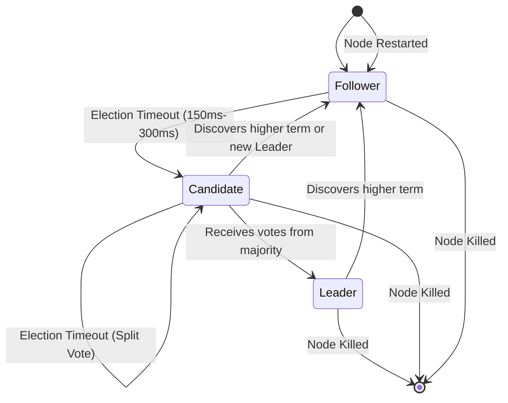
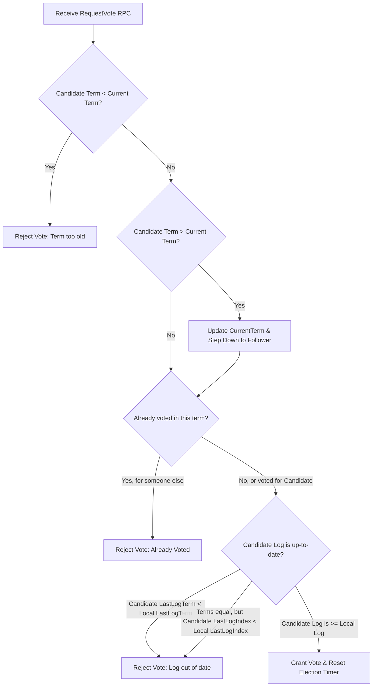

# Raft Election & Decision Tree

This document illustrates the Raft election process and voting logic using a Mermaid decision tree.

## Election Timeout & Candidate State

A follower transitions to a Candidate when its election timer expires without receiving a heartbeat from a Leader or granting a vote to another candidate.

## Voting Decision Logic

When a Candidate sends a `RequestVote` RPC, the receiving node evaluates the request based on the Candidate's term and log completeness.

### Log Completeness Rule
Raft dictates that a node cannot win an election unless its log is *at least as up-to-date* as the majority of the cluster. This is evaluated by:
1. Comparing the term of the last entry in the log.
2. If the terms are equal, comparing the length (index) of the logs.
